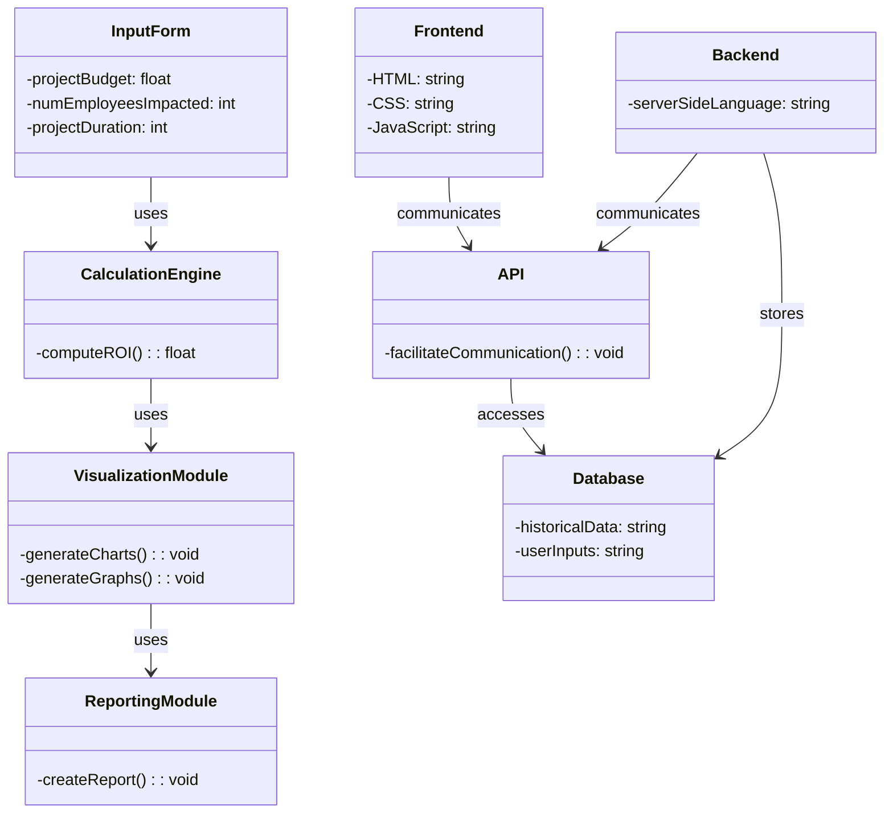

```mermaid
classDiagram
    class InputForm {
        -projectBudget: float
        -numEmployeesImpacted: int
        -projectDuration: int
    }
    
    class CalculationEngine {
        -computeROI(): float
    }
    
    class VisualizationModule {
        -generateCharts(): void
        -generateGraphs(): void
    }
    
    class ReportingModule {
        -createReport(): void
    }
    
    class Frontend {
        -HTML: string
        -CSS: string
        -JavaScript: string
    }
    
    class Backend {
        -serverSideLanguage: string
    }
    
    class Database {
        -historicalData: string
        -userInputs: string
    }
    
    class API {
        -facilitateCommunication(): void
    }

    InputForm --> CalculationEngine : uses
    CalculationEngine --> VisualizationModule : uses
    VisualizationModule --> ReportingModule : uses
    Frontend --> API : communicates
    Backend --> API : communicates
    Backend --> Database : stores
    API --> Database : accesses
```