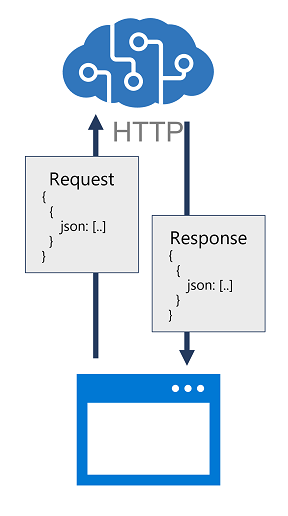

# ROI Calculator

This project is a simple ROI (Return on Investment) calculator designed to help leaders prepare for change initiatives by providing predictive insights, actionable recommendations, visualizations, and reports.

## Objectives and Goals

The primary objective of this project is to provide a tool that helps leaders make informed decisions about change initiatives by predicting the potential return on investment. The goals include:
- Offering predictive insights to guide decision-making.
- Providing actionable recommendations to maximize ROI.
- Delivering visualizations and reports to communicate findings effectively.

## Components

The ROI Calculator consists of the following components:
- **Input Form**: Collects data from users, including project budget, number of employees impacted, and project duration.
- **Calculation Engine**: Processes the input data to compute potential ROI, considering various factors such as financial risks and productivity gains.
- **Visualization Module**: Generates charts and graphs to visually represent the ROI and related insights.
- **Reporting Module**: Creates detailed reports summarizing the findings and recommendations.

## Architecture

The architecture of the ROI Calculator is designed to be modular and scalable:
- **Frontend**: Built using HTML, CSS, and JavaScript to create a user-friendly interface for data input and result visualization.
- **Backend**: Implemented with a server-side language (e.g., Python, Node.js) to handle data processing and calculations.
- **Database**: Stores historical data and user inputs for analysis and reporting purposes.
- **API**: Facilitates communication between the frontend and backend, ensuring seamless data flow and processing.

For a detailed overview of the system architecture, please refer to the [Architecture Documentation](./Arch.md).

## Approach

The approach to developing the ROI Calculator involved several key steps:
1. **Requirement Analysis**: Understanding the needs of leaders and the factors influencing ROI.
2. **Design**: Creating a user-friendly interface and a robust backend architecture.
3. **Implementation**: Developing the input form, calculation engine, visualization, and reporting modules.
4. **Testing**: Ensuring accuracy and reliability through rigorous testing.
5. **Deployment**: Making the tool available for use and gathering feedback for continuous improvement.

## Key Learnings

Throughout the development of the ROI Calculator, several key learnings emerged:
- The importance of user-centric design to ensure the tool is intuitive and easy to use.
- The need for accurate and comprehensive data to provide reliable insights and recommendations.
- The value of visualizations in helping users understand complex data and make informed decisions.
- The benefits of modular architecture in facilitating maintenance and scalability.
- The significance of continuous feedback and iteration to enhance the tool's effectiveness and user satisfaction.

## Features

- Input fields for:
  - Project Budget
  - Number of Employees Impacted
  - Duration of the Project
- Calculation of potential ROI based on user inputs
- Consideration of financial risks associated with project failure and employee disengagement
- Insights into potential savings from increased productivity, reduced risk, and successful project delivery

## Usage
- Acess the link in _About_
- Enter the project budget, number of impacted employees, and project duration in the respective input fields.
- Click the "Calculate ROI" button to see the results, including insights and recommendations based on the provided data.

## Contributing

Contributions are welcome! Please feel free to submit a pull request or open an issue for any suggestions or improvements.

## License

This project is licensed under the MIT License. See the LICENSE file for more details.
